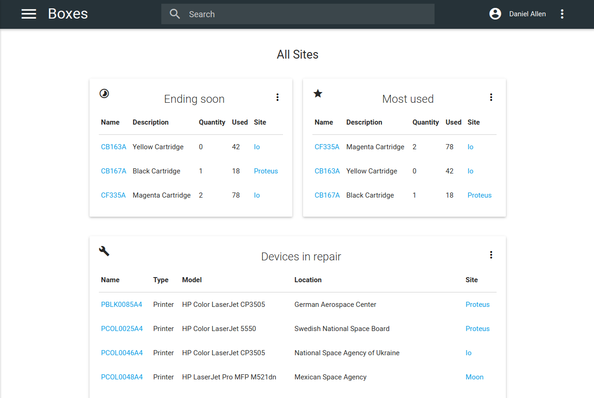

[](https://travis-ci.org/a118n/boxes)
[](https://codeclimate.com/github/a118n/boxes)

# Boxes
Boxes is an asset management web application written primarily for managing printers, MFPs and their supplies. It may prove handy in large offices and corporations where you have to keep track of multitude of devices and supplies they use.

> Note: Currently under active development.



### Features
* You can easily assign specific supplies to a particular device and vice versa
* An overview page displays critial and important information, such as supplies that are about to run out of stock, devices that are in repair, etc
* Monthly usage reports for supplies that are delivered to your mailbox
* Monthly usage statistics for each individual supply
* Email notifications when supply is about to run out of stock (controlled by individual threshold)


### Installation
> Note: This instruction describes a sample installation on a clean Ubuntu 16.04 LTS server.

#### Application Stack
The following software is required before installing the application. For a detailed instructions please refer to software providers and distribution manuals.
* Ruby ≥ 2.3.1
* [Phusion Passenger](https://www.phusionpassenger.com/)
* [ElasticSearch](https://www.elastic.co/products/elasticsearch)
* [Redis](http://redis.io/)
* NGINX
* MariaDB (or MySQL)
* Node.js

#### Prerequisites

Install required packages:

```sudo apt-get install build-essential ruby ruby-dev git libmysqlclient-dev mariadb-server elasticsearch redis-server```

Install Bundler:

```sudo gem install bundler```

Install Node.js:

```curl -sL https://deb.nodesource.com/setup_7.x | sudo -E bash -
sudo apt-get install -y nodejs```

#### Clone the repo

```git clone https://github.com/a118n/boxes.git && cd boxes```

#### Bundle up

```bundle install```

#### Set up database

``` sudo mysql_secure_installation```

Disable `auth_socket` plugin because it doesn't play nice with Rails:

```sudo mysql -u root```

```
MariaDB [(none)]>use mysql;
MariaDB [(mysql)]>update user set plugin=' ' where User='root';
MariaDB [(mysql)]>flush privileges;
MariaDB [(mysql)]>exit
```

Set up your root MySQL password as an environment variable:

```echo "export BOXES_DATABASE_PASSWORD='YourMySQLRootPassword'" | sudo tee -a /etc/profile```

Set up production secret key as an environment variable:

```echo "export SECRET_KEY_BASE='$(bundle exec rails secret)'" | sudo tee -a /etc/profile```

Load these variables into the shell:

```source /etc/profile```

Set up production database:

```RAILS_ENV=production bundle exec rails db:setup```

#### Set up ActionMailer

Set email address in `app/mailers/application_mailer.rb`

Set email address in `config/initializers/devise.rb`

Configure email server in `config/environments/production.rb`

#### Set up NGINX & Passenger

[This guide](https://www.phusionpassenger.com/library/install/nginx/install/oss/xenial/) describes installation of NGINX with Passenger.

[This guide](https://www.phusionpassenger.com/library/deploy/nginx/deploy/ruby/) describes application deployment.

Note: if you're having an error that says:

 `Could not find a JavaScript runtime. See https://github.com/sstephenson/execjs for a list of available runtimes. (ExecJS::RuntimeUnavailable)`

 Add ` env PATH;` on top of `/etc/nginx.conf`.

See [this issue](https://github.com/sstephenson/execjs/issues/77).

#### Set up Sidekiq

Copy `vendor/sidekiq.service` to `/lib/systemd/system`

Edit `/lib/systemd/system/sidekiq.service` and make sure you define full path to the application in `WorkingDirectory` as well as your username and/or group in `User` and `Group` respectively.